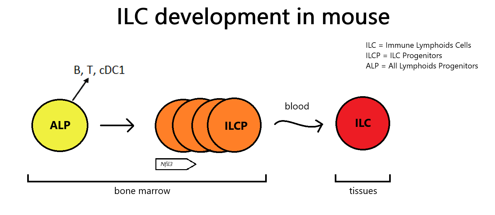

Figure adaptée de [Harly et al. 2018](https://doi.org/10.1084/jem.20170832).

---

# Influence de NFIL3 dans le développement des ILC chez la souris.

Ce dépôt contient tous les scripts et les ressources utilisés dans le papier:

Ce code source permet la génération des graphiques et données contribuant à caractériser les résidus fonctionnels, à analyser la relation structure-fonction, ainsi qu'à étudier les potentiels partenaires protéiques du facteur de transcription NFIL3, afin de mieux comprendre ses mécanismes d'actions dans le développement des ILC murins.

## Installation

### Prérequis

- conda version 24.11.3

### Étapes

Dans un terminal anaconda lancer les commandes suivantes:

```bash
git clone https://github.com/Floboysky/dvpILC.git
conda env create -f environment.yml
conda activate NFIL3_ILC
```

## Description et utilisation

Le dossier `example_data` contient des exemples de données qui peuvent être manipulées par le code source. Dans tous les codes présentés ci-dessous, toutes les variables `path` et `name` peuvent être changés par l'utilisateur.

### Analyse de la conservation

Ce chapitre décrit les bonnes pratiques d'utilisation des codes contenus dans le dossier `Analysis`.

L'extraction du score pLDDT est faite à partir du script `select_plddt_CA.sh`, qui prend cette donnée directement à partir des fichiers CIF obtenus avec [AlphaFold3](https://www.nature.com/articles/s41586-024-07487-w) (AF3). Son utilisation se fait automatiquement dans les fichiers `CA_bfactors_plddt.ipynb` et `conservation_nfil3.ipynb`, et doit être situé dans leur dossier parent.

- `CA_bfactors_plddt.ipynb` sert à comparer et à analyser graphiquement les scores de bfactors utilisée en cristallographie avec le score pLDDT utilisé par AF3. Le fichier est divisé en deux parties, la première contenant les fonctions nécessaire au fonctionnement du code et la seconde pour générer les graphiques. Exemple de fichiers à mettre en input pour l'étude du pLDDT (ouput de AF3: `example_data/MeCP2_TBL1R/fold_mmecp2_mtbl1r`), et pour l'étude du bfactor ([5NAF](https://www.rcsb.org/structure/5NAF): `example_data/MeCP2_TBL1R/Xp`). Les graphiques d'output obtenus sont dans le dossier `example_data/MeCP2_TBL1R/Plots`.

- `conservation.ipynb` permet une analyse graphique qui regroupe dans une dataframe (`example_data/NFIL3/Results`) les résultats de probabilité de désordre, de fiabilité, de qualité d'alignement, et de pression de conservation pour chaque résidu d'une protéine spécifique:
    - L'input pour l'étude du désordre intrinsèque est un fichier JSON obtenu via le serveur [AIUPred](https://academic.oup.com/nar/article/52/W1/W176/7673484) (`example_data/NFIL3/AIUPred`).
    - Pour la fiabilité (pLDDT), un output de AF3 à été pris en exemple (`example_data/NFIL3/fold_mnfil3`).
    - Les statistiques d'alignements sont obtenu à partir des fichiers d'output de l'outil [Jalview](https://academic.oup.com/bioinformatics/article/25/9/1189/203460) après un alignement global de séquences protéiques. (`example_data/NFIL3/Jalview`):

        - Le fichier "jalview_files.json" via l'onglet "Files/Output to Textbox" pour les données de séquences.
        - Le fichier "jalview_annotation.csv" via l'onglet "Files/Export Annotations..." pour les données brut.

    - L'analyse de la pression de conservation à été obtenue via le programme [EasyCodeML](https://onlinelibrary.wiley.com/doi/10.1002/ece3.5015) (`example_data/NFIL3/CodeML`). Pour fonctionner EasyCodeML à besoin d'un alignement protéique au format FASTA, de l'arbre phylogénétique de celui-ci au format NWK, et de la correspondance des séquences protéiques alignées avec les séquences génomiques au format PAML (obtenu avec le serveur [PAL2NAL](https://academic.oup.com/nar/article-lookup/doi/10.1093/nar/gkl315)). Le script `clean_fasta.py` permet de nettoyer l'index des différentes séquences génomiques ainsi alignées avant leur utilisation dans EasyCodeML. Pour chaque site extrait d'EasyCodeML dans le model 8 (M8) obtenu avec l'option "Site Model", le script extrait son estimation du rapport omega, son incertitude ainsi que sa probalité d'être dans la classe n°1.

### Analyse des interactions protéine-protéine

Ce chapitre décrit les bonnes pratiques d'utilisation du code contenu dans le dossier `PPI`.

Comme pour le chapitre ["Analyse de la conservation"](#analyse-de-la-conservation), l'extraction du pLDDT est automatiquement faite avec l'aide du script `select_plddt_CA.sh`. Il est utilisé par le script `alphafold3_lis_contact.ipynb`, et doit être placé dans son dossier parent.

- `alphafold3_lis_contact.ipynb`: est un programme adapté de [Kim et al. 2024](http://biorxiv.org/lookup/doi/10.1101/2024.02.19.580970), pour l'analyse des scores de PAE, iPTM, LIS, cLIS et LIA d'un complexe de deux protéines obtenu par AF3. Un exemple de donnée d'input a été placé dans le dossier `example_data/NFIL3_TBL1R`. Ce programme est aussi capable de fournir un graphique des pLDDT des carbones alpha pour tous les résidus, ainsi que les graphiques des valeurs de LIS et cLIS pour les résidus positifs (valeur max et moyenne) de chaque chaine du complexe. La sortie du programme est un fichier CSV contenant les résidus avec au moins une valeur de LIS ou de cLIS positive pour chaque protéine.

### Données dans BioGRID

- `data_BioGRID.py` permet de fusionner des fichiers CSV de donnés [BioGRID](https://thebiogrid.org/), pour permettre de compter le nombre d'occurences unique dans une colonne clé. Exemple avec la fusion des intéractions de TBL1 et TBL1R dans le dossier `data_BioGRID/TBL1X` et `data_BioGRID/TBL1XR1`.

### Scripts utiles dans PyMOL

Dossier contenant des scripts pour aider l'analyse des modèles protéique en 3D. A utiliser directement dans l'outil [PyMOL](https://www.pymol.org/).

- `helix_axis.py` est un programme qui trace une droite passant au plus proche du centre de gravité de chaque tour d'hélice (protéine ou ADN).

- `PyMOL_color.py`est utilisé pour colorer les carbones alpha des protéines avec les valeurs contenues dans les fichiers de résultats des scripts `conservation.ipynb` (jalview_output.json) et `alphafold3_lis_contact.ipynb` (data_all.csv files).

## Citation

```bibtex

```
